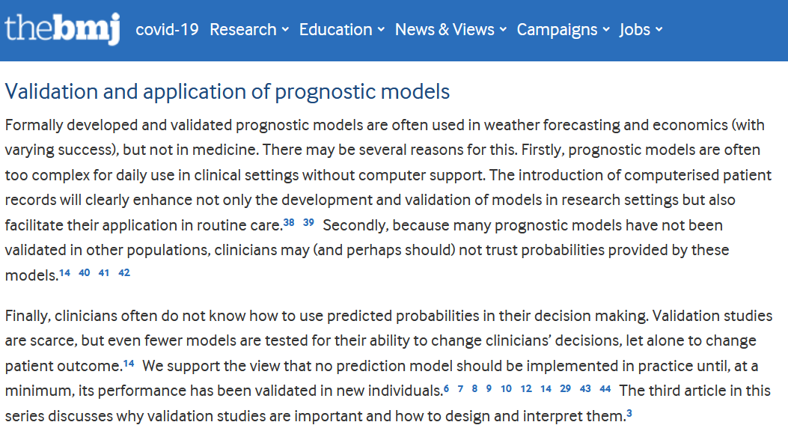
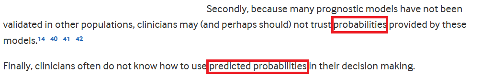
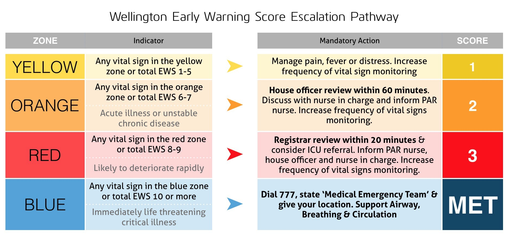
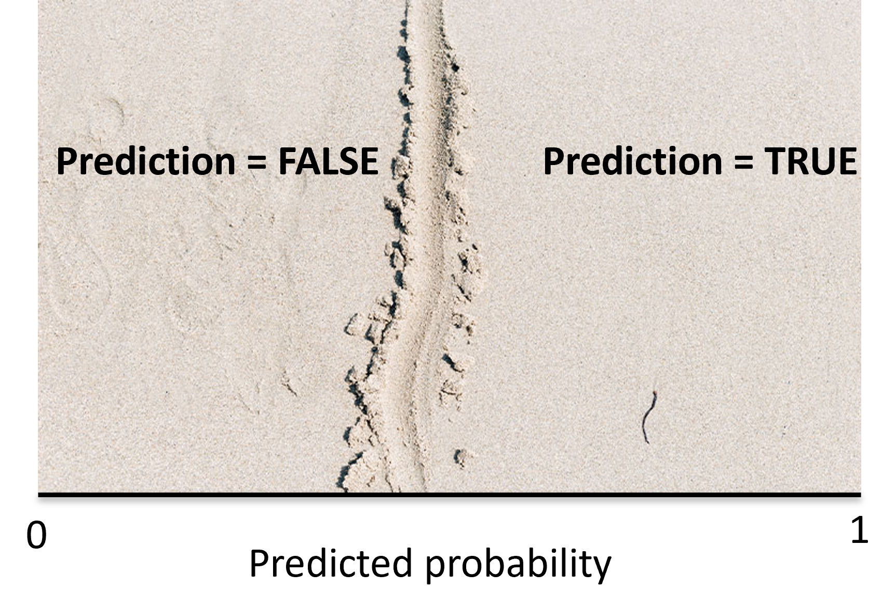
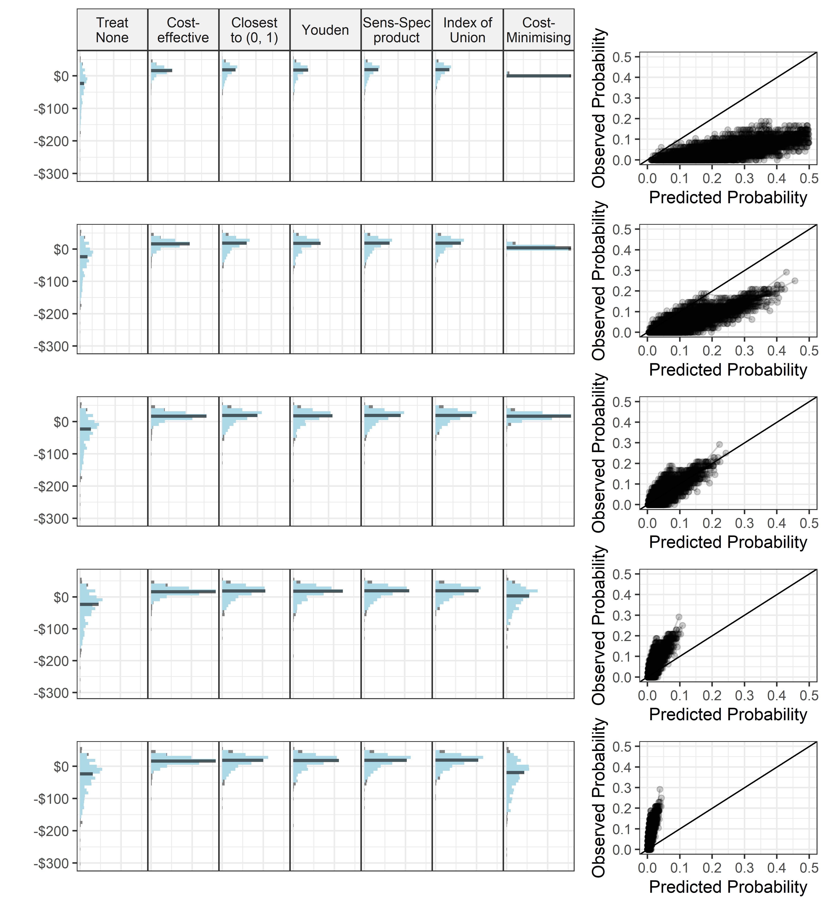

```{r setup, include=FALSE}
knitr::opts_chunk$set(echo = TRUE)
library(tidyverse)
library(kableExtra)
library(predictNMB)
source("src/functions.R")
```

<script src="https://ajax.googleapis.com/ajax/libs/jquery/3.1.1/jquery.min.js"></script>
<script>
$(document).ready(function() {
  $('slide:not(.backdrop):not(.title-slide)').append('<div class=\"footnotes\">');

  $('footnote').each(function(index) {
    var text  = $(this).html();
    var fnNum = (index+1).toString();
    $(this).html(fnNum.sup());

    var footnote   = fnNum + '. ' + text + '<br/>';
    var oldContent = $(this).parents('slide').children('div.footnotes').html();
    var newContent = oldContent + footnote;
    $(this).parents('slide').children('div.footnotes').html(newContent);
  });
});
</script>

## Outline

- Background to prediction models and cutpoints
- Integrating economic considerations into cutpoint selection
- Simulation study results


## Prediction models

{.center height=300px}

>- Do they have it? (diagnostic)
>- Will they get it? (prognostic)


>- Estimates patient risk given some data

## Prediction models

{.center height=400px}

## Prediction models


But how do they inform the user?

>- Probability/Odds of fall
>- Binary (intervention vs none) or 3+ (🚦) categories


## Prediction models


But how do they inform the user?


- **Probability/Odds of fall**
- Binary (intervention vs none) or 3+ (🚦) categories

## Prediction models <footnote>Karel G M Moons et al. "Prognosis and prognostic research: what, why, and how?" *BMJ* (2009).</footnote>

{.center height=400px}

---

{.center height=140px}

<br>
<br>
<br>
<br>

Probabilities are ideal but hard to interpret


## Prediction models {.build}

But how do they inform the user?

- Probability/Odds of fall
- **Binary (intervention vs none) or 3+ (🚦) categories**

<p float="left">
  
  
</p>


## Cutpoints


{.center height=323px}


## Cutpoints


{.center height=400px}


## Cutpoints


{.center height=400px}


## {.fullscreen}

```{r, echo=F, message=F, warning=F}
shiny::shinyAppDir("apps/prediction-threshold-slider/")
```

## Cutpoint selection methods

All maximise a performance based metric (not outcome) <footnote>Ilker Unal. "Defining an Optimal Cut-Point Value in ROC Analysis: An Alternative Approach." *Computational and Mathematical Methods in Medicine* (2017).</footnote>

- Youden index: $J(c) = Se(c) + Sp(c) - 1$

- Sens-Spec product: $CZ(c) = Se(c) \times Sp(c)$

- Index of Union: $IU(c) = |Se(c) − AUC| + |Sp(c) − AUC|$

- The Closest to (0, 1) Criteria: $ER(c) = \sqrt{(1 − Se(c)^2) + (1 − Sp(c)^2)}$

<br>

>- None of these consider anything beyond the model itself (costs, patient outcomes, interventions)


## Objectives {.build}


- Integrate information of patient outcomes and treatment costs into cutpoint selection

>- Evaluate how it compares to other cutpoint selection methods using a simulation study

<br>
... Get sidetracked


## Evaluation {.build}

Net Monetary Benefit (NMB) is calculated separately for each possible classification.

```{r, echo=F}
data.frame(
  row.names = c("Actually Positive", "Actually Negative"),
  P_Positive = c("TRUE POSITIVE (TP)", "FALSE POSITIVE (FP)"), 
  P_Negative = c("FALSE NEGATIVE (FN)", "TRUE NEGATIVE (TN)")
) %>%
  rename("Predicted Positive" = P_Positive,
         "Predicted Negative" = P_Negative) %>%
  kable() %>%
  kable_styling(font_size=15, full_width=FALSE) %>%
  column_spec(1, bold=T)
```

```{r, echo=F}
data.frame(
  row.names = c("Actually Positive", "Actually Negative"),
  P_Positive = c(
    "$NMB = COST_{outcome}\\times(1-EFFECT_{treatment}) + COST_{treatment}$", 
    "$NMB = COST_{treatment}$"
  ), 
  P_Negative = c(
    "$NMB = COST_{outcome}$",
    "$NMB = 0$"
  )
) %>%
  rename("Predicted Positive" = P_Positive,
         "Predicted Negative" = P_Negative) %>%
  kable() %>%
  kable_styling(font_size=15, full_width=FALSE) %>%
  column_spec(1, bold=T)
```

<div class="notes">
$$ 
\scriptsize COST_{outcome} = QALY\times WTP
\\
\tiny
NMB = COST_{outcome}\times(1-EFFECT_{treatment}) + COST_{treatment}
$$
</div>

## Cost-effective cutpoint {.build}

The `{cutpointr}` R package by Christian Thiele includes almost all the cutpoint selection methods and also allows you to pass custom metrics that aren't already built in (also made an update to the package after a twitter DM that streamlined this project)

Applied a custom metric and `{cutpointr}` to maximise NMB: 

$$
\small
CE(c) = n_{TP} \times NMB_{TP} + n_{FP} \times NMB_{FP} + n_{TN} \times NMB_{TN} + n_{FN} \times NMB_{FN}
$$

## Cost-effective cutpoint {.build}

$$
\small
CE(c) = n_{TP} \times NMB_{TP} + n_{FP} \times NMB_{FP} + n_{TN} \times NMB_{TN} + n_{FN} \times NMB_{FN}
$$

```{r, echo=F}
data.frame(
  row.names = c("Actually Positive", "Actually Negative"),
  P_Positive = c(
    "$NMB_{TP} = COST_{outcome}\\times(1-EFFECT_{treatment}) + COST_{treatment}$", 
    "$NMB_{FP} = COST_{treatment}$"
  ), 
  P_Negative = c(
    "$NMB_{FN} = COST_{outcome}$",
    "$NMB_{TN} = 0$"
  )
) %>%
  rename("Predicted Positive" = P_Positive,
         "Predicted Negative" = P_Negative) %>%
  kable('html') %>%
  kable_styling(font_size=15, full_width=FALSE, latex_options = c('hold_position')) %>%
  column_spec(1, bold=T)

```

```{r, echo=F}
data.frame(
  row.names = c("Actually Positive", "Actually Negative"),
  P_Positive = c("TRUE POSITIVE ($n_{TP}$)", "FALSE POSITIVE ($n_{FP}$)"), 
  P_Negative = c("FALSE NEGATIVE ($n_{FN}$)", "TRUE NEGATIVE ($n_{TN}$)")
) %>%
  rename("Predicted Positive" = P_Positive,
         "Predicted Negative" = P_Negative) %>%
  kable() %>%
  kable_styling(font_size=15, full_width=FALSE) %>%
  column_spec(1, bold=T)
```

## Cost-effective cutpoint

$$
\small
CE(c) = \color{red}{n_{TP}} \times \color{red}{NMB_{TP}} + n_{FP} \times NMB_{FP} + n_{TN} \times NMB_{TN} + n_{FN} \times NMB_{FN}
$$

```{r, echo=F}
data.frame(
  row.names = c("Actually Positive", "Actually Negative"),
  P_Positive = c(
    "$\\color{red}{NMB_{TP}} = COST_{outcome}\\times(1-EFFECT_{treatment}) + COST_{treatment}$", 
    "$NMB_{FP} = COST_{treatment}$"
  ), 
  P_Negative = c(
    "$NMB_{FN} = COST_{outcome}$",
    "$NMB_{TN} = 0$"
  )
) %>%
  rename("Predicted Positive" = P_Positive,
         "Predicted Negative" = P_Negative) %>%
  kable('html') %>%
  kable_styling(font_size=15, full_width=FALSE, latex_options = c('hold_position')) %>%
  column_spec(1, bold=T)

```

```{r, echo=F}
data.frame(
  row.names = c("Actually Positive", "Actually Negative"),
  P_Positive = c("TRUE POSITIVE ($\\color{red}{n_{TP}}$)", "FALSE POSITIVE ($n_{FP}$)"), 
  P_Negative = c("FALSE NEGATIVE ($n_{FN}$)", "TRUE NEGATIVE ($n_{TN}$)")
) %>%
  rename("Predicted Positive" = P_Positive,
         "Predicted Negative" = P_Negative) %>%
  kable() %>%
  kable_styling(font_size=15, full_width=FALSE) %>%
  column_spec(1, bold=T)
```

## Cost-effective cutpoint

$$
\small
CE(c) = n_{TP} \times NMB_{TP} + \color{blue}{n_{FP}} \times \color{blue}{NMB_{FP}} + n_{TN} \times NMB_{TN} + n_{FN} \times NMB_{FN}
$$

```{r, echo=F}
data.frame(
  row.names = c("Actually Positive", "Actually Negative"),
  P_Positive = c(
    "$NMB_{TP} = COST_{outcome}\\times(1-EFFECT_{treatment}) + COST_{treatment}$", 
    "$\\color{blue}{NMB_{FP}} = COST_{treatment}$"
  ), 
  P_Negative = c(
    "$NMB_{FN} = COST_{outcome}$",
    "$NMB_{TN} = 0$"
  )
) %>%
  rename("Predicted Positive" = P_Positive,
         "Predicted Negative" = P_Negative) %>%
  kable('html') %>%
  kable_styling(font_size=15, full_width=FALSE, latex_options = c('hold_position')) %>%
  column_spec(1, bold=T)

```

```{r, echo=F}
data.frame(
  row.names = c("Actually Positive", "Actually Negative"),
  P_Positive = c("TRUE POSITIVE ($n_{TP}$)", "FALSE POSITIVE ($\\color{blue}{n_{FP}}$)"), 
  P_Negative = c("FALSE NEGATIVE ($n_{FN}$)", "TRUE NEGATIVE ($n_{TN}$)")
) %>%
  rename("Predicted Positive" = P_Positive,
         "Predicted Negative" = P_Negative) %>%
  kable() %>%
  kable_styling(font_size=15, full_width=FALSE) %>%
  column_spec(1, bold=T)
```


## Simulation study - inpatient falls

- Values for intervention effectiveness, healthcare costs, and patient outcomes literature
  - Patient education intervention
  - Healthcare costs
  - QALYs lost from falls
  - WTP of 28k

>- Used point estimates of these for obtaining the cost-effective-threshold but incorporated uncertainty for evaluation


## Simulation loop {.build}

>1. Sample training data (given model AUC and event rate)
>2. Fit prediction model
>3. Obtain cutpoints using each method (cost-effective method uses point estimates)
>4. Sample validation data (n=10,000)
>5. Get predicted probabilities for validation data using the fitted model
>6. Get NMB values for each class by sampling costs/effectiveness values from their distributions
>7. Calculate NMB for validation set under each cutpoint (obtained in step 3) and store results

<div style="text-align: right">**Repeat 5,000 times**</div>

## Simulation loop

1. **Sample training data (given model AUC and event rate)**
2. Fit prediction model
3. Obtain cutpoints using each method (cost-effective method uses point estimates)
4. **Sample validation data (n=10,000)**
5. Get predicted probabilities for validation data using the fitted model
6. Get NMB values for each class by sampling costs/effectiveness values from their distributions
7. Calculate NMB for validation set under each cutpoint (obtained in step 3) and store results

<div style="text-align: right">**Repeat 5,000 times**</div>


## Sampling data

Existing approaches sample coefficients from MVN and then use those to sample the outcome.

- No ability to specify AUC or event rate

I want:

```r
get_sample <- function(n_samples, model_auc, event_rate){
  ...
  return(dataset)
}
```

## Sampling data {.build .smaller} 

Approach:

>- Transform AUC to Cohens' D <footnote>Jesús F. Salgado. "Transforming the Area under the Normal Curve (AUC) into Cohen’s d, Pearson’s rpb, Odds-Ratio, and Natural Log Odds-Ratio: Two Conversion Tables" *European Journal of Psychology Applied to Legal Context* (2018).</footnote>
>- Sample the number of positives from binomial distribution given event rate and number of samples

```r
get_sample <- function(n_samples, model_auc, event_rate){
  cohens_d <- ...
  n_pos <- ...
  n_neg <- ...
  
  x <- c(rnorm(n_neg, mean = 0, sd = 1), 
         rnorm(n_pos, mean = cohens_d, sd = 1))
  y <- c(rep(0, n_neg), 
         rep(1, n_pos))

  return(data.frame(x = x, y = y))
}
```
## Sampling data

```{r, echo=F}
sample_data <- 
  predictNMB::get_sample(auc=0.7, n_samples=10000, prevalence=0.05) %>%
  rename(y=actual)
```

```r
sample_data <- get_sample(n_samples=10000, model_auc=0.7, event_rate=0.05)
```

```{r, message=F, warning=F}
model <- glm(y ~ x, data=sample_data, family=binomial())
sample_data$prob <- predict(model, type="response")

pROC::auc(sample_data$y, sample_data$prob)
```

## Sampling data

```{r, echo=F, fig.align="center", fig.height=5}
df_calplot <- 
  sample_data %>%
  mutate(bin = ntile(prob, 10)) %>%
  group_by(bin) %>%
  summarize(
    n=n(), 
    bin_pred=mean(prob),
    bin_prob=mean(y),
    se=sqrt((bin_prob * (1 - bin_prob)) / n),
    ul = bin_prob + 1.96*se,
    ll = bin_prob - 1.96*se
  ) %>%
  ungroup() 

df_calplot %>% 
  ggplot() + 
  geom_pointrange(data=df_calplot, aes(x=bin_pred, y=bin_prob, ymin=ll, ymax=ul), alpha=0.6)+
  geom_abline() +
  theme_bw() +
  coord_equal() +
  labs(
    title="Results in a calibrated model",
    x="Predicted",
    y="Observed"
  )

```


## Results - primary analysis

- Costs and outcomes from inpatient falls literature
- Event rate: 3.6%
- Model AUC: 0.7

## Results - primary analysis

```{r, echo=F, warning=F, message=F, fig.align="center", fig.height=5}
falls_sim <- readRDS("input/falls_sim_data.rds")

cols_rename <- c(
  "Treat All"="treat_all",
  "Treat None"="treat_none",
  "Cost-effective" ="cost_effective",
  "The Closest to (0, 1) Criteria"="er", 
  "Youden"="youden", 
  "Sens-Spec product"="cz", 
  "Index of Union"="iu"
)

falls_sim$df_result <- 
  falls_sim$df_result %>%
  rename(any_of(cols_rename))

falls_sim$df_result %>%
  plot_fw_histogram(
    hdi=F, 
    plot_labels=labs(x="Incremental Net Monetary Benefit (AUD)\n(reference method: Treat All)\n", y=""), 
    inb_ref_col='Treat All'
  )

```

## Results - primary analysis

```{r, echo=F, fig.align='center', fig.height=4.8, fig.width=10}
df_percent_best <- 
  falls_sim$df_result %>%
  pivot_longer(!n_sim) %>%
  group_by(n_sim) %>%
  arrange(desc(value)) %>% 
  slice(1) %>%
  ungroup() %>%
  group_by(name) %>%
  summarize(n=n())

# make table with % winner
data.frame(name=names(falls_sim$df_result)[-1]) %>%
  left_join(., df_percent_best, by="name") %>%
  mutate(
    n=ifelse(is.na(n), 0, n),
    `%`=scales::percent(n/nrow(falls_sim$df_result))
  ) %>%
  arrange(desc(n)) %>%
  rename("Method"=name) %>%
  kable(caption="Number of simulations with best NMB") %>%
  kable_styling(font_size=15, full_width=FALSE, position="float_left") %>%
  column_spec(1, bold=T)

# table of median NMB
falls_sim$df_result %>%
  pivot_longer(!n_sim) %>%
  group_by("Cutpoint method"=name) %>%
  summarize(median_nmb = median(value),
            mean_nmb = mean(value)) %>%
  arrange(desc(mean_nmb)) %>%
  mutate("Median NMB" = scales::dollar_format()(median_nmb),
         "Mean NMB" = scales::dollar_format()(mean_nmb)) %>%
  select(-median_nmb, -mean_nmb) %>%
  kable(caption="NMB under each cutpoint method") %>%
  kable_styling(font_size=15, full_width=FALSE, position="float_right") %>%
  column_spec(1, bold=T)

```


## {.fullscreen}

```{r echo=F, fig.align='center', fig.height=6.5, fig.width=7}
auc_title <- 
  cowplot::ggdraw() + 
  cowplot::draw_label("Benefit is greater for less discriminant models", fontface='bold')
cowplot::plot_grid(auc_title, readRDS("input/auc_plot.rds"), rel_heights=c(0.05,1), ncol=1)
```


## {.fullscreen}

```{r echo=F, fig.align='center', fig.height=6.5, fig.width=7}
event_rate_title <- 
  cowplot::ggdraw() + 
  cowplot::draw_label("Benefit is greater for rarer events (... or more common events?)", fontface='bold')
cowplot::plot_grid(event_rate_title, readRDS("input/event_rate_plot.rds"), rel_heights=c(0.05,1), ncol=1)
```

## shiny app

```{r, echo=F, warning=F, message=F}
shiny::shinyAppDir("apps/cost-effective-cpms-app/")
```

## Cost-minimising cutpoint {.fullside}

$t=\frac{C_{FP}-C_{TN}}{C_{FP}+C_{FN}-C_{TP}-C_{TN}}$


## {.fullside}

$t=\frac{C_{FP}-C_{TN}}{C_{FP}+C_{FN}-C_{TP}-C_{TN}}$ 


## Conclusions {.build}

- Considering costs when selecting a model cutpoint may facilitate value-based care
- Optimising NMB in the cutpoint method is be better than existing cost-minimisation approach when models are poorly calibrated


## Conclusions

- Considering costs when selecting a model cutpoint may facilitate value-based care
- Optimising NMB in the cutpoint method is be better than existing cost-minimisation approach when models are poorly calibrated
- The best approach may be to treat-all or treat-none (requires simulation)

<p float="left">
  
  
</p>


## `{predictNMB}`  {.build}

{width=30px align="left"} github.com/RWParsons/predictNMB

- How would my model perform regarding NMB?
  - versus treat-all, treat-none, and under any cutpoint selection method

>- What happens when the intervention changes?
>- What happens when the model improves?
>- What happens when the event rate changes?

Applies to both diagnostic and prognostic models, as long as it's possible to cost correct and incorrect classifications

```{r, echo=F}
# remove all objects from first part of talk so that there's no conflicts with predictNMB functions
rm(list=ls())
```


## `{predictNMB}` 

Simulated situation:

- Healthcare event costs $100
- A treatment that reduces the probability of these events by a third costs $10

<p float="left">
  
  
</p>

## `{predictNMB}` 


```{r}
fx_nmb1 <- function(...) {
  c(
    "TP" = -100*(1-1/3)-10, # cost of the outcome (reduced by treatment effect) 
                            # - cost of treatment
    "FP" =  -10,  # cost of treatment
    "TN" =    0,  # no cost of treatment or outcome
    "FN" = -100   # full cost of the outcome
  )
}
map_dfr(1:3, fx_nmb1)
```

---

```r
plot(density(rbeta(1000, 10, 20)))  # Effectiveness
plot(density(rgamma(1000, 100)))    # Cost of outcome
```

```{r, fig.align='hold', echo=F, fig.width=10}
par(mfrow=c(1,2))
plot(density(rbeta(1000, 10, 20)))
plot(density(rgamma(1000, 100)))
```

---

```{r}
fx_nmb2 <- function(...) {
  effectiveness <- rbeta(1, 10, 20)
  event_cost <- rgamma(1, 100)
  treatment_cost <- 10
  
  c(
    "TP" = -event_cost * (1-effectiveness) - treatment_cost,
    "FP" = -treatment_cost, 
    "TN" =  0,
    "FN" = -event_cost
  )
}
map_dfr(1:3, fx_nmb2)
```

## `{predictNMB}` 

```{r, include=F}
library(predictNMB)
# cl <- parallel::makeCluster(parallel::detectCores())
# sim_obj <- do_nmb_sim(
#   n_sims = 5000, n_valid = 10000, sim_auc = 0.7, event_rate = 0.1,
#   fx_nmb_training = fx_nmb1, fx_nmb_evaluation = fx_nmb2,
#   cutpoint_methods = c("all", "none", "youden", "cost_effective"),
#   meet_min_events = TRUE, cl = cl
# )
# saveRDS(sim_obj, "input/sim_obj.rds")

sim_obj <- readRDS("input/sim_obj.rds")

# screen_obj <- screen_simulation_inputs(
#   n_sims = 5000, n_valid = 10000, sim_auc = seq(0.7, 0.95, 0.05), event_rate = c(0.01, 0.05, 0.1),
#   fx_nmb_training = fx_nmb1, fx_nmb_evaluation = fx_nmb2,
#   cutpoint_methods = c("all", "none", "youden", "cost_effective"),
#   meet_min_events = TRUE, cl = cl
# )
# saveRDS(screen_obj, "input/screen_obj.rds")

screen_obj <- readRDS("input/screen_obj.rds")
```

```r
library(predictNMB)
sim_obj <- do_nmb_sim(
  n_sims = 5000, n_valid = 10000, sim_auc = 0.7, event_rate = 0.1,
  fx_nmb_training = fx_nmb1, fx_nmb_evaluation = fx_nmb2,
  cutpoint_methods = c("all", "none", "youden", "cost_effective")
)
```

```{r}
sim_obj
```

## `{predictNMB}`  

```{r, fig.align="center"}
plot(sim_obj)
```

## `{predictNMB}`  

```r
screen_obj <- screen_simulation_inputs(
  n_sims = 5000, n_valid = 10000, 
  sim_auc = seq(0.7, 0.95, 0.05), event_rate = c(0.01, 0.05, 0.1),
  fx_nmb_training = fx_nmb1, fx_nmb_evaluation = fx_nmb2,
  cutpoint_methods = c("all", "none", "youden", "cost_effective")
)
```

---

```{r, message=F, fig.align="center"}
named_vec <- c("Treat All" = "all", "Treat None" = "none",
               "Youden Index" = "youden","Cost-effective" = "cost_effective")
plot(screen_obj, rename_vector=named_vec)
```

---

```{r, message=F, fig.align="center"}
plot(screen_obj, rename_vector=named_vec, what="inb", inb_ref_col="Treat All")
```

---

```{r, message=F, fig.align="center"}
plot(screen_obj, rename_vector=named_vec, x_axis_var="event_rate")
```

## New intervention? {.smaller}

```{r, echo=F}
n <- 10000
rbind(
  data.frame(eff=rbeta(n, 10, 20), group="Old treatment"),
  data.frame(eff=rbeta(n, 10, 15), group="New treatment")
) %>%
  ggplot(aes(x=eff, col=group, fill=group)) + 
  geom_density(size=1, alpha=0.3) +
  theme_bw() +
  labs(y="",
       x="effectiveness",
       fill="", col="")
```

---

```{r}
fx_nmb_old <- function(...) {
  effectiveness <- rbeta(1, 10, 20)
  event_cost <- rgamma(1, 100)
  treatment_cost <- 10
  c(
    "TP" = -event_cost * (1-effectiveness) - treatment_cost,
    "FP" = -treatment_cost, 
    "TN" =  0,
    "FN" = -event_cost
  )
}
fx_nmb_new <- function(...) {
  effectiveness <- rbeta(1, 10, 15)
  event_cost <- rgamma(1, 100)
  treatment_cost <- 8
  c(
    "TP" = -event_cost * (1-effectiveness) - treatment_cost,
    "FP" = -treatment_cost, 
    "TN" =  0,
    "FN" = -event_cost
  )
}
```
---

```{r, echo=F}
# cl <- parallel::makeCluster(parallel::detectCores())
# screen_obj_intervention <- screen_simulation_inputs(
#   n_sims = 5000, n_valid = 10000, sim_auc = seq(0.7, 0.95, 0.05), event_rate = 0.05,
#   fx_nmb_training = fx_nmb_old,
#   fx_nmb_evaluation = list("fx_nmb_old"=fx_nmb_old, "fx_nmb_new"=fx_nmb_new),
#   cutpoint_methods = c("all", "none", "youden"), meet_min_events = TRUE, cl = cl
# )
# saveRDS(screen_obj_intervention, "input/screen_obj_intervention.rds")
# plot(screen_obj_intervention, x_axis_var = "fx_nmb_evaluation")

screen_obj_intervention <- readRDS("input/screen_obj_intervention.rds")
```

```r
screen_obj_intervention <- screen_simulation_inputs(
  n_sims = 5000, n_valid = 10000, sim_auc = seq(0.7, 0.95, 0.05), event_rate = 0.05,
  fx_nmb_training = fx_nmb_old,
  fx_nmb_evaluation = list("fx_nmb_old"=fx_nmb_old, "fx_nmb_new"=fx_nmb_new),
  cutpoint_methods = c("all", "none", "youden"), meet_min_events = TRUE, 
  cl = parallel::makeCluster(parallel::detectCores())
)
```

---

```{r, message=F}
plot(screen_obj_intervention, x_axis_var = "fx_nmb_evaluation")
```

## `{predictNMB}`  {.build}


```{r}
make_summary_table(sim_obj)
```

---

```{r}
make_summary_table(screen_obj_intervention)
```


## `{predictNMB}`  {.build}

>- How good does my model need to be useful (in the context of how it'd be used)?
>- What is the relative merit of X improvement of my model's AUC (in \$)?
>- How might the viability of my model change in a new patient population?

What's next:

>- Incorporate feedback from you!

## Thank you 

  - Robin Blythe
  - Susanna Cramb
  - Steven McPhail

{width=30 align="left"} @Rex_Parsons8  

{width=30px align="left"} @RWParsons

{width=30px align="left"} http://rwparsons.github.io/

shiny app: [aushsi.shinyapps.io/cost-effective-cpms-app/](https://aushsi.shinyapps.io/cost-effective-cpms-app/)

`{predictNMB}`: [github.com/RWParsons/predictNMB](https://github.com/RWParsons/predictNMB)

slides: [github.com/RWParsons/ssa-qld-presentation-august22](https://github.com/RWParsons/ssa-qld-presentation-august22)
